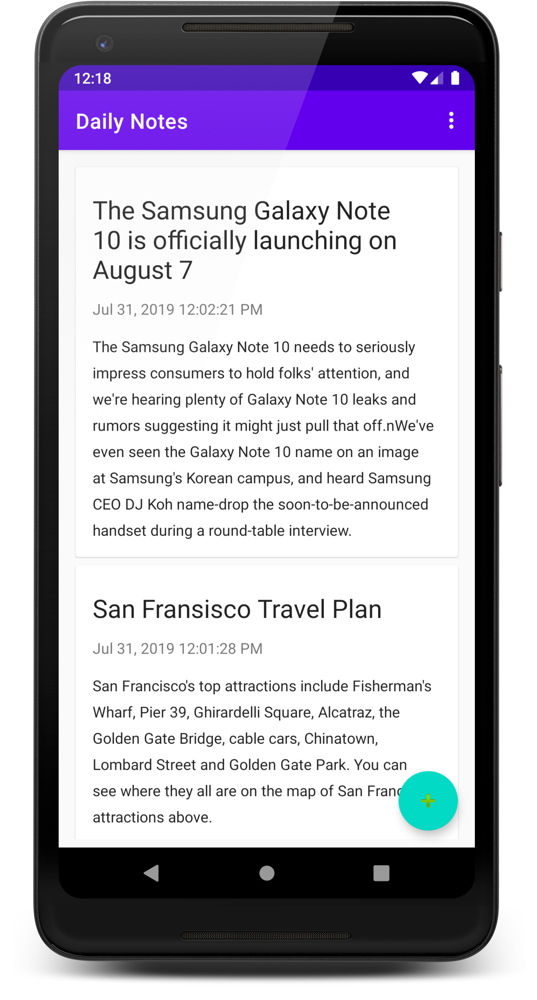
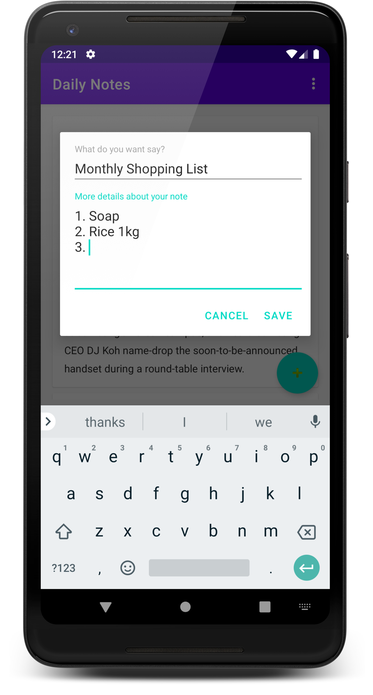
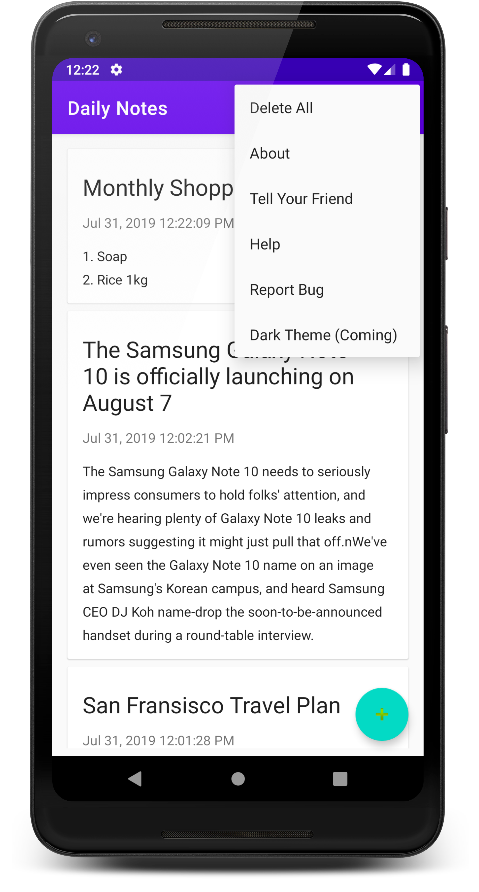

# Daily Notes

## Simple Note Taking app that implements MVVM architecture using Room and Google Material Design.
 

#### Quickly capture what’s on your mind. Daily Notes makes it easy to save a thought or list for yourself. Capture what’s on your mind.

# Download
<a href="https://play.google.com/store/apps/details?id=com.prathameshmore.dailynotes"/>

# Screenshots
|   |   |
|---|---|
|||
|   |

