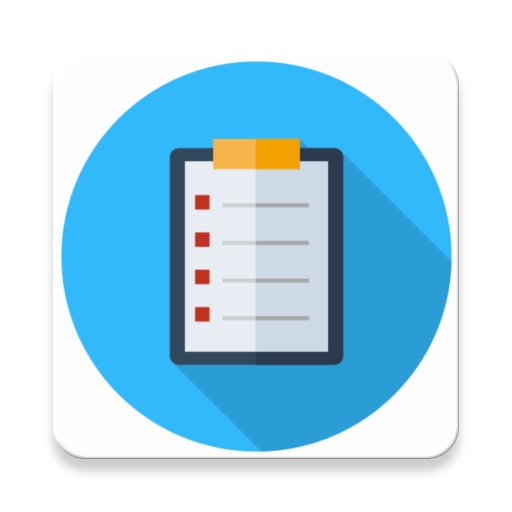
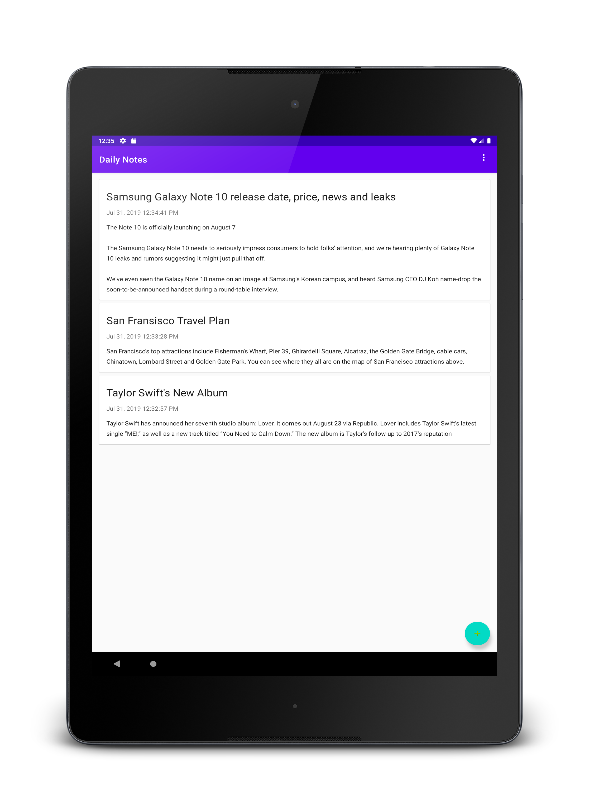

# Daily Notes

## Simple Note Taking app that implements MVVM architecture using Room and Google Material Design.
 

#### Quickly capture what’s on your mind. Daily Notes makes it easy to save a thought or list for yourself. Capture what’s on your mind.

# Download

# Screenshots

{:height="100px" width="100px"}

